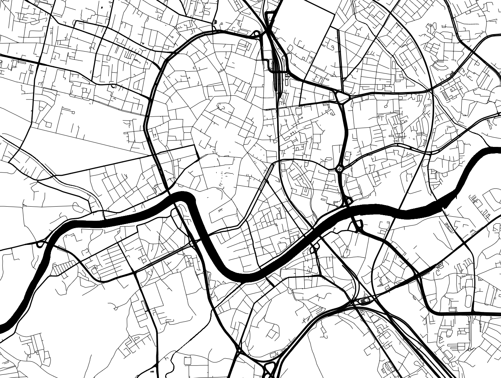

= Madutnik

Mapbox styles:

- link:styles/dye.json[Dye], a https://maps.stamen.com/toner[Toner]-inspired, extreme contrast style.

== Quickstart

This repository has a `docker-compose.yml` file that will start an instance of the https://github.com/maptiler/tileserver-gl[TileServer GL] to test the styles.

A map of Kraków, Poland is provided as an example.
Commercial use of this map is prohibited.
Check the license of the data before using it in your own projects.

The compose file also includes an instance of https://maputnik.github.io[Maputnik] to edit the styles.

To start the stack, simply run:

[source,bash]
----
docker-compose up
----

Then go to http://localhost:8080[localhost:8080] to see the map or http://localhost:8888[localhost:8888] to edit the styles.

---
ifdef::env-github[]

++++
<!--suppress HtmlDeprecatedAttribute -->

  <a href="https://www.maptiler.com/copyright">
    © MapTiler
  </a>
  <a href="https://stamen.com">
    © Stamen Design
  </a>
  <a href="https://www.openstreetmap.org/copyright">
    © OpenStreetMap contributors
  </a>

++++

endif::[]
ifndef::env-github[]

[.text-center]
https://www.maptiler.com/copyright[© MapTiler]
https://stamen.com[© Stamen Design]
https://www.openstreetmap.org/copyright[© OpenStreetMap contributors]

endif::[]
